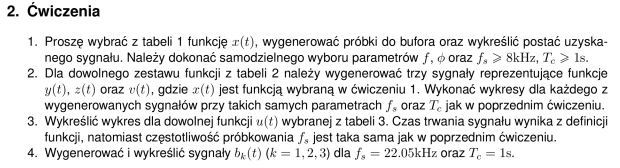
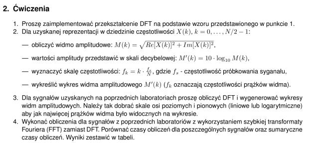
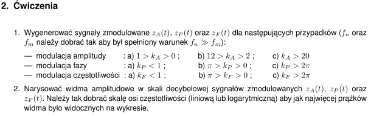
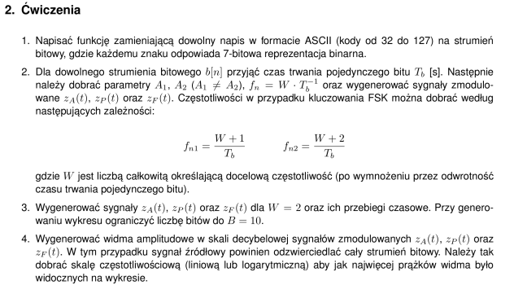
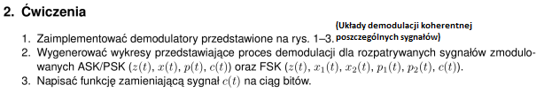
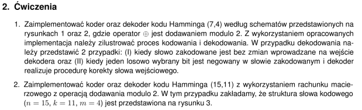
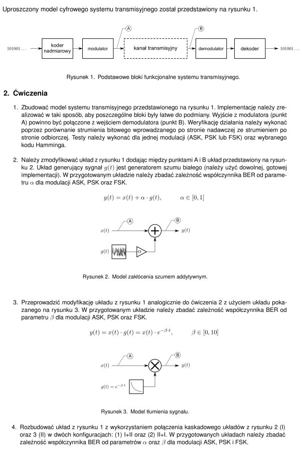
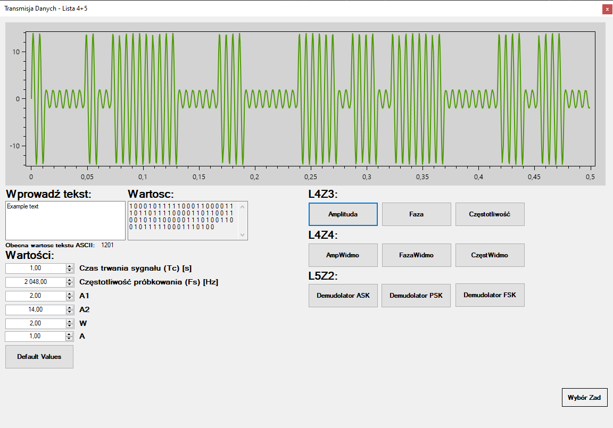
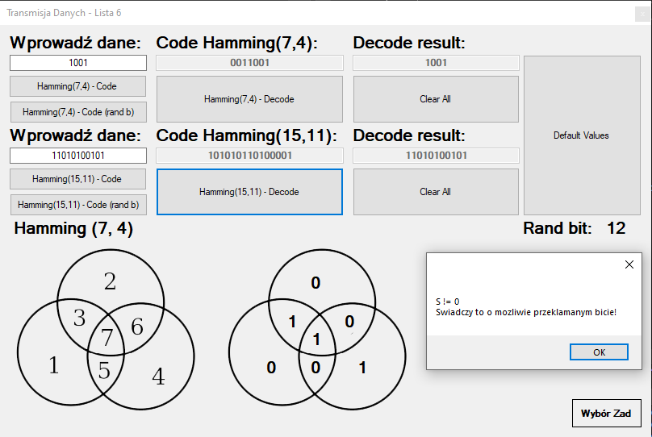

# TransmisjaDanych
Repozytorium zawierające programy wykonane w trakcie kursu "Transmisja Danych" w roku S4/2022

# Treść poszczególnych zadań:  
**Wszystkie zadania zostały opracowane przez Doktora Tomasza Mąke, oraz są jego własnością intelektualną.** Zadania zostały umieszczone w tym repozytorium czysto w celu informacyjnym, dla osób przeglądających repozytorium.

  
 Lab 1 

  

  
 Lab 2 

  

  
 Lab 3 

  

  
 Lab 4 + 5 

  
  

  
 Lab 6 

  

  
 Lab 7 

  

# Przykładowe działanie programu:

  
 Zadania z laboratorium 4 i 5 

  Amplituda obliczona na podstawie wprowadzonych danych i zwizualizowana na wykresie
  

  
 Zadania z laboratorium 6 

    Kodowanie Hamminga (7,4) oraz (15,11) dla wprowadzonych tablic, przedstawiony został także przypadek gdy jeden z bitów jest losowo negowany, algorytm to wykrywa i podejmuje próbę naprawienia błędu.
  

